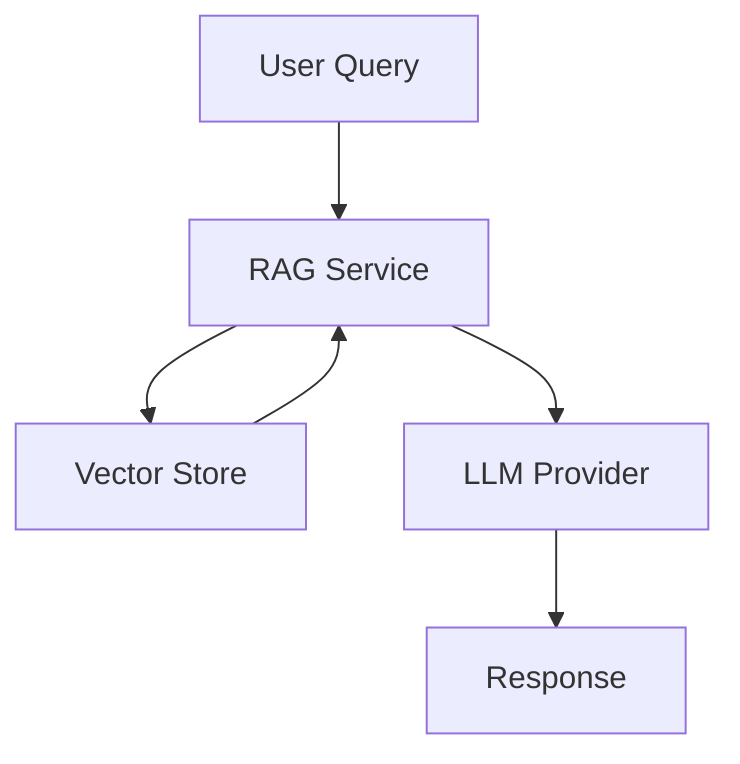
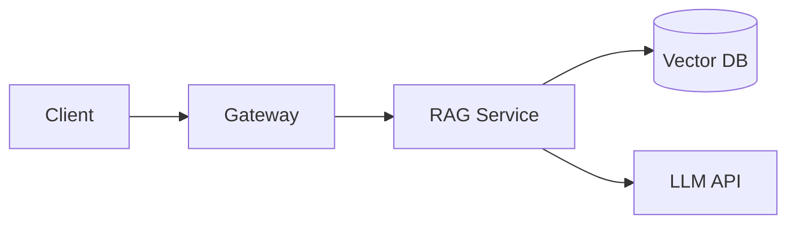

# Documentation Guide

This guide explains how to write and maintain documentation for the AI Accelerators platform.

## Overview

Good documentation is essential for:
- Onboarding new team members
- Enabling self-service adoption
- Reducing support burden
- Maintaining knowledge over time

All documentation is written in Markdown and rendered via Backstage TechDocs.

## Documentation Types

### Getting Started

**Location**: `docs/getting-started/`

**Purpose**: Help new users become productive quickly

**Characteristics**:
- Task-oriented
- Step-by-step instructions
- Minimal prerequisites assumed
- Quick wins within 15 minutes

### API Reference

**Location**: `docs/sdk/` or inline docstrings

**Purpose**: Complete reference for all public APIs

**Characteristics**:
- Every public function/class documented
- Type signatures included
- Usage examples for each
- Generated from code where possible

### Guides and Tutorials

**Location**: `docs/templates/` or `docs/infrastructure/`

**Purpose**: Deep-dive explanations and walkthroughs

**Characteristics**:
- Explain the "why" not just the "how"
- Build complete examples
- Address common questions
- Include troubleshooting

### Architecture Documentation

**Location**: `docs/architecture/` or ADRs

**Purpose**: Explain design decisions and system structure

**Characteristics**:
- High-level overviews
- Diagrams and visuals
- Decision rationale
- Trade-offs discussed

## Documentation Standards

### File Structure

```
docs/
├── getting-started/
│   ├── index.md        # Section overview
│   ├── quickstart.md   # 15-minute tutorial
│   └── ...
├── sdk/
│   ├── docs/           # SDK documentation
│   │   ├── index.md
│   │   └── ...
│   └── mkdocs.yml      # TechDocs config
├── contributing/
│   ├── index.md
│   └── ...
└── ...
```

### File Naming

- Use lowercase with hyphens: `development-setup.md`
- Use `index.md` for section landing pages
- Use descriptive names: `api-reference.md` not `api.md`

### Front Matter

Optional YAML front matter for metadata:

```markdown
---
title: Development Setup
description: Set up your local development environment
---

# Development Setup
...
```

## Writing Style

### Voice and Tone

- **Use second person**: "You can configure..." not "One can configure..."
- **Use active voice**: "The function returns..." not "A value is returned..."
- **Be direct**: "Run this command" not "You might want to run this command"
- **Be inclusive**: Avoid jargon; explain technical terms

### Formatting

- **Use sentence case** for headings: "Getting started" not "Getting Started"
- **Use code formatting** for:
  - File names: `config.py`
  - Commands: `pip install accelerators`
  - Code references: `LLMClient`
- **Use bold** for UI elements: Click **Save**
- **Use italics** for emphasis sparingly

### Structure

```markdown
# Page Title

Brief introduction explaining what this page covers.

## Section Heading

Content for this section.

### Subsection

More detailed content.

## Another Section

Continue with content...
```

### Lists

Use bullet points for unordered items:

```markdown
Key features include:
- Fast inference
- Low latency
- High accuracy
```

Use numbered lists for sequential steps:

```markdown
1. Clone the repository
2. Install dependencies
3. Run the application
```

## Code Examples

### Requirements

All code examples must be:
- Complete and runnable
- Include necessary imports
- Use meaningful variable names
- Be tested and verified

### Format

Use fenced code blocks with language identifiers:

````markdown
```python
from accelerators.llm import LLMClient

client = LLMClient(provider="anthropic")
response = await client.complete(messages)
```
````

### Multiple Languages

Show examples in relevant languages:

````markdown
=== "Python"

    ```python
    client = LLMClient(provider="anthropic")
    ```

=== "TypeScript"

    ```typescript
    const client = new LLMClient({ provider: 'anthropic' });
    ```
````

### Output Examples

Show expected output when helpful:

````markdown
```bash
$ pip install accelerators
Successfully installed accelerators-1.0.0
```
````

## Diagrams

### Mermaid Diagrams

Use Mermaid for diagrams (supported by TechDocs):

````markdown

````

### Guidelines

- Include text description for accessibility
- Keep diagrams simple and focused
- Use consistent styling
- Update diagrams when architecture changes

### Example with Description

````markdown
## Architecture Overview



The client sends queries through the API gateway, which routes to the RAG service.
The RAG service retrieves relevant documents from the vector database and generates
responses using the configured LLM provider.
````

## Tables

Use tables for structured information:

```markdown
| Parameter | Type | Required | Description |
|-----------|------|----------|-------------|
| `query` | string | Yes | The search query |
| `top_k` | int | No | Number of results (default: 10) |
| `filters` | object | No | Metadata filters |
```

## Links

### Internal Links

Use relative paths for internal links:

```markdown
See the [Development Setup](development-setup.md) guide.
See the [SDK Documentation](../sdk/docs/index.md).
```

### External Links

Use full URLs for external links:

```markdown
See the [FastAPI documentation](https://fastapi.tiangolo.com/).
```

### Anchor Links

Link to specific sections:

```markdown
See [Error Handling](#error-handling) below.
```

## Admonitions

Use admonitions for callouts:

````markdown
!!! note
    This is important information.

!!! warning
    Be careful with this operation.

!!! tip
    Here's a helpful suggestion.

!!! danger
    This action is destructive.
````

## TechDocs Configuration

Each documentation section needs a `mkdocs.yml`:

```yaml
site_name: Contributing Guide
site_description: Guidelines for contributing to AI Accelerators

nav:
  - Home: index.md
  - Development Setup: development-setup.md
  - Coding Standards: coding-standards.md
  - Testing Guide: testing-guide.md
  - Documentation Guide: documentation-guide.md
  - Pull Request Guide: pull-request-guide.md
  - Release Process: release-process.md

plugins:
  - techdocs-core
```

## Backstage Catalog Integration

Documentation is linked to Backstage via `catalog-info.yaml`:

```yaml
apiVersion: backstage.io/v1alpha1
kind: Component
metadata:
  name: contributor-guide
  title: Contributor Guide
  description: Guidelines for contributing to the AI Accelerators platform
  annotations:
    backstage.io/techdocs-ref: dir:docs/contributing
spec:
  type: documentation
  lifecycle: production
  owner: ai-platform-team
```

## Review Checklist

Before submitting documentation:

- [ ] Spell check completed
- [ ] All links verified working
- [ ] Code examples tested
- [ ] Consistent formatting used
- [ ] Follows style guidelines
- [ ] TechDocs builds successfully

## Building Documentation Locally

```bash
# Install MkDocs
pip install mkdocs-techdocs-core

# Build documentation
cd docs/contributing
mkdocs build

# Serve locally
mkdocs serve
# Open http://localhost:8000
```

## Common Issues

### Broken Links

Check links before submitting:
```bash
# Install linkchecker
pip install linkchecker

# Check links
linkchecker docs/
```

### TechDocs Build Failures

Common causes:
- Missing `mkdocs.yml` file
- Invalid YAML syntax
- Missing referenced files
- Incorrect file paths in nav

### Images Not Rendering

Ensure images are in the correct location:
```
docs/contributing/
├── index.md
└── images/
    └── architecture.png
```

Reference with relative path:
```markdown

```

## Resources

- [MkDocs Documentation](https://www.mkdocs.org/)
- [Material for MkDocs](https://squidfunk.github.io/mkdocs-material/)
- [Backstage TechDocs](https://backstage.io/docs/features/techdocs/)
- [Mermaid Documentation](https://mermaid.js.org/)
