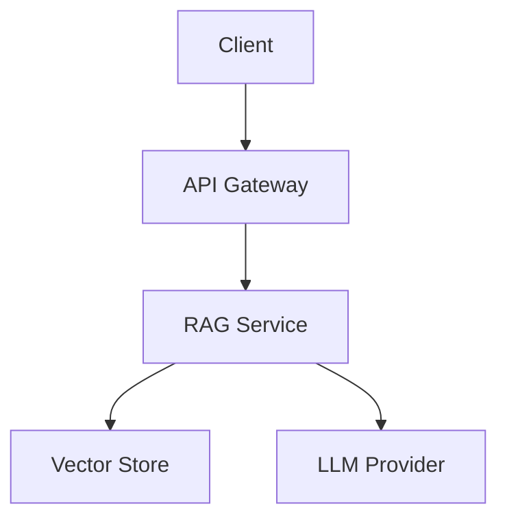

# AI Accelerators Repository - Product Requirements Document

**Version:** 1.0  
**Author:** Milan Stokic  
**Last Updated:** January 2026  
**Status:** Draft

---

## 1. Executive Summary

The AI Accelerators Repository is a monorepo containing reusable templates, a shared Python SDK, and Terraform infrastructure modules for rapidly building and deploying production-ready AI applications. The repository enables engineers to go from zero to deployed AI application in under 4 hours while maintaining enterprise-grade quality, security, and observability standards.

This PRD defines the requirements for the repository structure, core SDK, accelerator templates, infrastructure modules, documentation standards, and AI-assisted development configurations.

---

## 2. Problem Statement

### Current Pain Points

1. **Repetitive bootstrapping**: Every AI project requires setting up the same foundational components—LLM clients, vector databases, observability, authentication, and deployment pipelines
2. **Inconsistent implementations**: Teams solve the same problems differently, leading to maintenance burden and knowledge silos
3. **Production readiness gaps**: POCs work locally but lack the infrastructure, security, and observability needed for production
4. **Slow iteration cycles**: Without standardized patterns, debugging and extending AI applications takes longer than necessary
5. **Documentation debt**: Knowledge lives in engineers' heads or scattered across Slack, making onboarding painful

### Target Outcome

A single repository that provides battle-tested, production-ready components for the most common AI application patterns, enabling any engineer to deploy a fully operational AI system in hours rather than weeks.

---

## 3. Goals and Non-Goals

### Goals

| Priority | Goal |
|----------|------|
| P0 | Reduce time-to-first-deployment for standard AI applications to < 4 hours |
| P0 | Establish consistent, maintainable patterns across all AI projects |
| P0 | Provide comprehensive, up-to-date documentation for all components |
| P1 | Enable cloud-agnostic deployment with GCP as primary target |
| P1 | Support AI-assisted development workflows (Claude Code, Cursor, etc.) |
| P1 | Maintain separation between opinionated templates and flexible SDK |
| P2 | Enable gradual adoption—teams can use SDK without full templates |
| P2 | Support offline/air-gapped development for sensitive environments |

### Non-Goals

- Building a proprietary framework that locks teams into specific patterns
- Replacing existing mature tools (LangChain, LlamaIndex) where they excel
- Supporting every possible LLM provider or cloud platform from day one
- Creating a GUI or low-code interface for template generation
- Hosting or managing deployed applications (deployment is self-service)

---

## 4. Success Metrics

| Metric | Baseline | Target | Measurement |
|--------|----------|--------|-------------|
| Time to first deployment | 2-3 weeks | < 4 hours | Tracked via template usage logs |
| Template adoption rate | N/A | 80% of new AI projects | Repository analytics |
| SDK package downloads | N/A | 500/month internal | Package registry metrics |
| Documentation coverage | N/A | 100% of public APIs | Automated doc coverage tools |
| Mean time to onboard | 2-4 weeks | < 3 days | Developer surveys |
| Production incidents from template bugs | N/A | < 1/quarter | Incident tracking |

---

## 5. User Personas

### 5.1 AI Engineer

**Context**: Building AI-powered features and applications full-time  
**Needs**: Production-ready templates, LLM debugging tools, evaluation frameworks  
**Uses**: Full templates, SDK deeply, infrastructure modules  
**Documentation**: API reference, architecture guides, troubleshooting

### 5.2 Full-Stack Developer

**Context**: Adding AI capabilities to existing applications  
**Needs**: Simple integration patterns, React components, clear APIs  
**Uses**: SDK for LLM calls, React chat components, minimal infrastructure  
**Documentation**: Quick-start guides, code examples, integration patterns

### 5.3 Platform Engineer

**Context**: Maintaining infrastructure, CI/CD, and security  
**Needs**: Terraform modules, deployment patterns, security controls  
**Uses**: Infrastructure modules, CI/CD templates, observability setup  
**Documentation**: Infrastructure reference, runbooks, security guidelines

### 5.4 Technical Lead

**Context**: Making architecture decisions, ensuring consistency  
**Needs**: Understanding design decisions, customization options, upgrade paths  
**Uses**: ADRs, architecture docs, contribution guidelines  
**Documentation**: Design documents, ADRs, roadmap

---

## 6. Repository Structure

```
ai-accelerators/
│
├── README.md                          # Repository overview and quick start
├── CONTRIBUTING.md                    # Contribution guidelines
├── CHANGELOG.md                       # Version history
├── LICENSE                            # License file
│
├── docs/                              # Central documentation hub
│   ├── index.md                       # Documentation home
│   ├── getting-started/               # Onboarding documentation
│   ├── architecture/                  # Architecture documentation
│   ├── sdk/                           # SDK reference documentation
│   ├── templates/                     # Template-specific documentation
│   ├── infrastructure/                # Infrastructure documentation
│   ├── operations/                    # Operational documentation
│   ├── contributing/                  # Contributor documentation
│   └── adr/                           # Architecture Decision Records
│
├── sdk/                               # Core Python SDK
│   ├── README.md
│   ├── pyproject.toml
│   ├── src/
│   │   └── accelerators/
│   │       ├── __init__.py
│   │       ├── llm/                   # LLM provider abstractions
│   │       ├── vectorstore/           # Vector database operations
│   │       ├── embeddings/            # Embedding generation
│   │       ├── observability/         # Langfuse integration
│   │       ├── auth/                  # Authentication utilities
│   │       ├── config/                # Configuration management
│   │       └── evals/                 # Evaluation framework
│   └── tests/
│
├── templates/                         # Application templates
│   ├── README.md
│   ├── rag-api/                       # RAG application template
│   ├── chat-agent/                    # Conversational agent template
│   ├── doc-processor/                 # Document processing template
│   ├── voice-assistant/               # Voice/telephony template
│   └── react-chat-ui/                 # React frontend template
│
├── infra/                             # Infrastructure as Code
│   ├── README.md
│   ├── modules/                       # Reusable Terraform modules
│   │   ├── cloud-run/
│   │   ├── cloud-sql/
│   │   ├── qdrant/
│   │   ├── redis/
│   │   ├── networking/
│   │   ├── secrets/
│   │   └── observability/
│   └── examples/                      # Example environment configurations
│       ├── dev/
│       ├── staging/
│       └── prod/
│
├── .claude/                           # AI coding tool configurations
│   ├── settings.json
│   └── commands/                      # Custom Claude Code commands
│
├── .github/                           # GitHub configurations
│   ├── workflows/                     # CI/CD pipelines
│   ├── ISSUE_TEMPLATE/
│   ├── PULL_REQUEST_TEMPLATE.md
│   └── CODEOWNERS
│
└── scripts/                           # Development and maintenance scripts
    ├── setup.sh                       # Local development setup
    ├── create-template.sh             # Template scaffolding
    └── validate-docs.sh               # Documentation validation
```

---

## 7. Core SDK Requirements

### 7.1 Overview

The SDK (`accelerators`) is a Python package providing abstractions and utilities shared across all templates. It is designed to be:

- **Incrementally adoptable**: Use one module without importing everything
- **Provider-agnostic**: Swap LLM or vector DB providers via configuration
- **Observable by default**: All operations instrumented for Langfuse
- **Type-safe**: Full type hints and Pydantic models
- **Well-documented**: Docstrings, examples, and reference docs for all public APIs

### 7.2 Module Requirements

#### 7.2.1 LLM Module (`accelerators.llm`)

**Purpose**: Unified interface for interacting with LLM providers

**Supported Providers** (P0):
- Anthropic (Claude)
- OpenAI (GPT-4, GPT-4o)
- Google (Gemini)
- Ollama (local models)

**Features**:
- Streaming and non-streaming completions
- Tool/function calling with automatic schema generation
- Structured output with Pydantic models
- Automatic retries with exponential backoff
- Token counting and cost estimation
- Request/response logging to Langfuse

**Interface**:
```python
from accelerators.llm import LLMClient, Message

client = LLMClient(provider="anthropic", model="claude-sonnet-4-20250514")

# Simple completion
response = await client.complete(
    messages=[Message(role="user", content="Hello")],
    max_tokens=1000
)

# Streaming
async for chunk in client.stream(messages):
    print(chunk.content, end="")

# Structured output
class ExtractedEntity(BaseModel):
    name: str
    entity_type: str
    confidence: float

entities = await client.complete(
    messages=messages,
    response_model=ExtractedEntity
)

# Tool calling
@tool
def search_database(query: str) -> list[dict]:
    """Search the internal database."""
    ...

response = await client.complete(
    messages=messages,
    tools=[search_database]
)
```

#### 7.2.2 Vector Store Module (`accelerators.vectorstore`)

**Purpose**: Unified interface for vector database operations

**Supported Providers** (P0):
- Qdrant (primary)
- PostgreSQL with pgvector (fallback)

**Features**:
- Collection management (create, delete, configure)
- Document upsert with metadata
- Similarity search with filters
- Hybrid search (dense + sparse)
- Batch operations with progress tracking
- Automatic embedding generation

**Interface**:
```python
from accelerators.vectorstore import VectorStore, Document

store = VectorStore(provider="qdrant", collection="knowledge_base")

# Upsert documents
await store.upsert([
    Document(id="doc1", content="...", metadata={"source": "wiki"}),
    Document(id="doc2", content="...", metadata={"source": "docs"}),
])

# Search
results = await store.search(
    query="How do I deploy?",
    limit=10,
    filters={"source": "docs"},
    search_type="hybrid"  # dense, sparse, or hybrid
)
```

#### 7.2.3 Embeddings Module (`accelerators.embeddings`)

**Purpose**: Generate embeddings for text content

**Supported Providers** (P0):
- OpenAI (text-embedding-3-small, text-embedding-3-large)
- Sentence Transformers (local)

**Features**:
- Batch embedding generation
- Caching layer (optional Redis)
- Dimension reduction (for cost optimization)
- Automatic chunking for long texts

#### 7.2.4 Observability Module (`accelerators.observability`)

**Purpose**: Instrument applications for monitoring and debugging

**Features**:
- Langfuse integration for LLM tracing
- Automatic trace propagation
- Custom span creation
- Evaluation logging
- Cost tracking
- Latency metrics

**Interface**:
```python
from accelerators.observability import trace, observe

@observe(name="rag_query")
async def handle_query(query: str) -> str:
    with trace.span("retrieval"):
        docs = await retrieve(query)
    
    with trace.span("generation"):
        response = await generate(query, docs)
    
    trace.log_evaluation(
        name="relevance",
        score=0.85,
        comment="Retrieved docs were relevant"
    )
    
    return response
```

#### 7.2.5 Auth Module (`accelerators.auth`)

**Purpose**: Authentication and authorization utilities

**Features**:
- API key validation
- JWT token handling
- Service account authentication (GCP)
- Rate limiting helpers
- RBAC utilities

#### 7.2.6 Config Module (`accelerators.config`)

**Purpose**: Configuration management with environment awareness

**Features**:
- Pydantic Settings integration
- Environment variable loading
- Secret Manager integration (GCP)
- Configuration validation
- Hot reloading (optional)

**Interface**:
```python
from accelerators.config import Settings, SecretString

class AppSettings(Settings):
    llm_provider: str = "anthropic"
    llm_model: str = "claude-sonnet-4-20250514"
    anthropic_api_key: SecretString  # Auto-loaded from Secret Manager
    qdrant_url: str
    debug: bool = False
    
    class Config:
        env_prefix = "APP_"

settings = AppSettings()  # Loads from environment + secrets
```

#### 7.2.7 Evals Module (`accelerators.evals`)

**Purpose**: Evaluation framework for AI applications

**Features**:
- Built-in evaluators (relevance, faithfulness, coherence)
- Custom evaluator support
- Batch evaluation pipelines
- Integration with Langfuse datasets
- Regression testing utilities

---

## 8. Template Requirements

### 8.1 Common Requirements

All templates must include:

| Requirement | Description |
|-------------|-------------|
| SDK Integration | Use `accelerators` SDK for LLM, vector store, and observability |
| Configuration | Pydantic Settings with environment variable support |
| Health Checks | `/health` and `/ready` endpoints for orchestration |
| OpenAPI Spec | Auto-generated API documentation |
| Dockerfile | Multi-stage build optimized for size and security |
| CI/CD | Cloud Build configuration for build, test, deploy |
| Terraform | Infrastructure module for deployment |
| Tests | Unit, integration, and e2e test suites |
| Documentation | Template-specific docs in `docs/` folder |
| Claude Commands | `.claude/commands/` for AI-assisted development |

### 8.2 RAG Application Template

**Use Cases**: Document Q&A, knowledge bases, semantic search, customer support

**Components**:
- FastAPI application with query and ingestion endpoints
- Document loaders (PDF, DOCX, Markdown, HTML)
- Chunking strategies (recursive, semantic, sliding window)
- Hybrid retrieval (dense + sparse vectors)
- Reranking (cross-encoder or LLM-based)
- Response generation with source citations
- Conversation memory (optional)
- Streaming responses

**Endpoints**:
```
POST /query              # Query the knowledge base
POST /query/stream       # Streaming query response
POST /ingest             # Ingest documents
POST /ingest/url         # Ingest from URL
DELETE /documents/{id}   # Remove document
GET /collections         # List collections
GET /health              # Health check
```

### 8.3 Conversational Agent Template

**Use Cases**: Customer service bots, internal assistants, task automation

**Components**:
- LangGraph-based agent with tool calling
- Conversation state management
- Tool registry with dynamic loading
- Multi-turn conversation handling
- Handoff to human workflow
- Streaming responses with intermediate steps

**Endpoints**:
```
POST /chat               # Send message, get response
POST /chat/stream        # Streaming chat
GET /conversations/{id}  # Get conversation history
DELETE /conversations/{id}  # Clear conversation
GET /tools               # List available tools
GET /health              # Health check
```

### 8.4 Document Processor Template

**Use Cases**: Data extraction, classification, summarization, translation

**Components**:
- Async job processing with Cloud Tasks
- Document parsing (PDF, images, scanned docs)
- Extraction pipelines with structured output
- Classification with confidence scores
- Batch processing with progress tracking
- Result storage and retrieval

**Endpoints**:
```
POST /jobs               # Submit processing job
GET /jobs/{id}           # Get job status
GET /jobs/{id}/result    # Get job result
POST /process/sync       # Synchronous processing (small docs)
GET /health              # Health check
```

### 8.5 Voice Assistant Template

**Use Cases**: Call center automation, voice agents, IVR replacement

**Components**:
- Twilio/Vonage integration for telephony
- Real-time speech-to-text (Deepgram/AssemblyAI)
- Text-to-speech with voice selection
- Conversation orchestration
- Call recording and transcription
- Handoff to human agents

**Endpoints**:
```
POST /calls/inbound      # Handle inbound call webhook
POST /calls/outbound     # Initiate outbound call
GET /calls/{id}          # Get call details
GET /calls/{id}/transcript  # Get call transcript
WebSocket /calls/{id}/stream  # Real-time audio stream
GET /health              # Health check
```

### 8.6 React Chat UI Template

**Use Cases**: Chat interfaces for any AI application

**Components**:
- React 18+ with TypeScript
- Vite build tooling
- shadcn/ui component library
- Streaming message display
- File upload with preview
- Code block rendering with syntax highlighting
- Markdown rendering
- Mobile-responsive design
- Dark/light theme support

**Structure**:
```
react-chat-ui/
├── src/
│   ├── components/
│   │   ├── chat/
│   │   │   ├── ChatContainer.tsx
│   │   │   ├── MessageList.tsx
│   │   │   ├── MessageBubble.tsx
│   │   │   ├── InputArea.tsx
│   │   │   └── StreamingMessage.tsx
│   │   ├── ui/                    # shadcn components
│   │   └── shared/
│   ├── hooks/
│   │   ├── useChat.ts
│   │   ├── useStreaming.ts
│   │   └── useFileUpload.ts
│   ├── lib/
│   │   ├── api.ts
│   │   └── utils.ts
│   └── types/
├── public/
└── package.json
```

---

## 9. Infrastructure Requirements

### 9.1 Terraform Modules

All modules must:
- Support GCP as primary provider
- Use variables for all configurable values
- Output resource identifiers and connection strings
- Include example usage in README
- Follow Terraform best practices (remote state, workspaces)

### 9.2 Required Modules

| Module | Purpose | Key Resources |
|--------|---------|---------------|
| `cloud-run` | Serverless container deployment | Cloud Run service, IAM, domain mapping |
| `cloud-sql` | PostgreSQL database | Cloud SQL instance, databases, users |
| `qdrant` | Vector database | Cloud Run or GKE deployment of Qdrant |
| `redis` | Caching and pub/sub | Memorystore Redis instance |
| `networking` | VPC and connectivity | VPC, subnets, serverless connector |
| `secrets` | Secret management | Secret Manager secrets and versions |
| `observability` | Monitoring stack | Langfuse deployment, Cloud Monitoring |

### 9.3 Environment Configurations

Provide example configurations for:
- **dev**: Minimal resources, low cost, single instance
- **staging**: Production-like but scaled down
- **prod**: Full HA, autoscaling, monitoring

---

## 10. Documentation Requirements

### 10.1 Documentation Standards

All documentation must:
- Be written in Markdown format
- Follow a consistent structure and style
- Include code examples that are tested and working
- Be versioned alongside code changes
- Pass automated validation checks
- Be reviewed as part of pull requests

### 10.2 Documentation Types

The repository must maintain the following documentation types:

#### 10.2.1 Getting Started Documentation

**Location**: `docs/getting-started/`

**Purpose**: Enable new users to become productive quickly

**Required Documents**:

| Document | Description |
|----------|-------------|
| `index.md` | Overview of the accelerators platform and navigation |
| `prerequisites.md` | Required tools, accounts, and access |
| `installation.md` | SDK installation and local setup |
| `quickstart.md` | 15-minute tutorial: deploy first application |
| `first-rag-app.md` | Step-by-step guide to building a RAG app |
| `first-agent.md` | Step-by-step guide to building a conversational agent |
| `local-development.md` | Local development environment setup |
| `faq.md` | Frequently asked questions |

#### 10.2.2 Architecture Documentation

**Location**: `docs/architecture/`

**Purpose**: Explain design decisions and system architecture

**Required Documents**:

| Document | Description |
|----------|-------------|
| `index.md` | Architecture overview and principles |
| `system-overview.md` | High-level system architecture with diagrams |
| `sdk-architecture.md` | SDK module structure and design patterns |
| `template-architecture.md` | Template structure and conventions |
| `security-architecture.md` | Security model, authentication, authorization |
| `data-flow.md` | How data flows through the system |
| `scalability.md` | Scaling patterns and considerations |
| `technology-choices.md` | Why specific technologies were chosen |

#### 10.2.3 SDK Reference Documentation

**Location**: `docs/sdk/`

**Purpose**: Complete API reference for the SDK

**Required Documents**:

| Document | Description |
|----------|-------------|
| `index.md` | SDK overview and module summary |
| `llm.md` | LLM module API reference |
| `vectorstore.md` | Vector store module API reference |
| `embeddings.md` | Embeddings module API reference |
| `observability.md` | Observability module API reference |
| `auth.md` | Auth module API reference |
| `config.md` | Config module API reference |
| `evals.md` | Evals module API reference |
| `exceptions.md` | Exception types and error handling |
| `types.md` | Common types and models |

**Format Requirements**:
- Every public function/class must be documented
- Include type signatures
- Include at least one usage example
- Document exceptions that may be raised
- Link to related functions/classes

#### 10.2.4 Template Documentation

**Location**: `docs/templates/`

**Purpose**: Guide users through each template

**Required Documents per Template**:

| Document | Description |
|----------|-------------|
| `{template}/index.md` | Template overview and use cases |
| `{template}/quickstart.md` | Get running in 15 minutes |
| `{template}/configuration.md` | All configuration options |
| `{template}/customization.md` | How to extend and modify |
| `{template}/api-reference.md` | API endpoint documentation |
| `{template}/deployment.md` | Deployment guide |
| `{template}/troubleshooting.md` | Common issues and solutions |

#### 10.2.5 Infrastructure Documentation

**Location**: `docs/infrastructure/`

**Purpose**: Guide infrastructure setup and management

**Required Documents**:

| Document | Description |
|----------|-------------|
| `index.md` | Infrastructure overview |
| `gcp-setup.md` | GCP project and account setup |
| `terraform-guide.md` | Terraform usage and best practices |
| `modules/index.md` | Terraform modules overview |
| `modules/{module}.md` | Per-module documentation with inputs/outputs |
| `environments.md` | Environment configuration guide |
| `networking.md` | VPC, connectivity, and firewall setup |
| `secrets.md` | Secret management guide |
| `cost-optimization.md` | Cost management and optimization |

#### 10.2.6 Operations Documentation

**Location**: `docs/operations/`

**Purpose**: Support production operations

**Required Documents**:

| Document | Description |
|----------|-------------|
| `index.md` | Operations overview |
| `monitoring.md` | Monitoring setup and dashboards |
| `logging.md` | Logging configuration and analysis |
| `alerting.md` | Alert configuration and response |
| `scaling.md` | Scaling procedures and automation |
| `backup-recovery.md` | Backup and disaster recovery |
| `security-operations.md` | Security monitoring and incident response |
| `runbooks/index.md` | Runbook index |
| `runbooks/{issue}.md` | Per-issue runbook |

**Runbook Requirements**:
- Every known failure mode must have a runbook
- Include symptoms, diagnosis steps, and resolution
- Include rollback procedures where applicable
- Link to relevant monitoring dashboards

#### 10.2.7 Contributing Documentation

**Location**: `docs/contributing/`

**Purpose**: Guide contributors

**Required Documents**:

| Document | Description |
|----------|-------------|
| `index.md` | Contributing overview |
| `development-setup.md` | Development environment setup |
| `coding-standards.md` | Code style and conventions |
| `testing-guide.md` | Testing requirements and practices |
| `documentation-guide.md` | How to write documentation |
| `pull-request-guide.md` | PR process and review criteria |
| `release-process.md` | Release and versioning process |

#### 10.2.8 Architecture Decision Records (ADRs)

**Location**: `docs/adr/`

**Purpose**: Document significant architecture decisions

**Format**: Each ADR must follow this template:

```markdown
# ADR-{NUMBER}: {TITLE}

## Status

{Proposed | Accepted | Deprecated | Superseded by ADR-XXX}

## Context

{What is the issue that we're seeing that is motivating this decision?}

## Decision

{What is the change that we're proposing and/or doing?}

## Consequences

{What becomes easier or more difficult to do because of this change?}

### Positive

- {Benefit 1}
- {Benefit 2}

### Negative

- {Drawback 1}
- {Drawback 2}

### Neutral

- {Neutral consequence}

## Alternatives Considered

### {Alternative 1}

{Description and why it was not chosen}

### {Alternative 2}

{Description and why it was not chosen}
```

**Required ADRs**:
- ADR-001: Monorepo structure
- ADR-002: Python SDK architecture
- ADR-003: LangGraph over LangChain agents
- ADR-004: Qdrant as primary vector database
- ADR-005: Cloud Run as primary compute
- ADR-006: Langfuse for observability
- ADR-007: Template scaffolding approach

### 10.3 Documentation Quality Requirements

#### 10.3.1 Style Guide

All documentation must:
- Use American English spelling
- Use present tense ("The function returns..." not "The function will return...")
- Use active voice where possible
- Use second person ("You can configure..." not "One can configure...")
- Include a brief introduction explaining what the document covers
- Use consistent heading hierarchy (H1 for title, H2 for sections, H3 for subsections)
- Limit line length to 120 characters for readability in editors
- Use fenced code blocks with language identifiers

#### 10.3.2 Code Examples

All code examples must:
- Be complete and runnable (no pseudo-code unless clearly marked)
- Include necessary imports
- Use meaningful variable names
- Include comments for non-obvious logic
- Be tested as part of CI (via doctest or dedicated test files)
- Show both basic and advanced usage where applicable

#### 10.3.3 Diagrams

Architecture and flow diagrams must:
- Be created using Mermaid (for version control)
- Include a text description for accessibility
- Use consistent styling across documents
- Be kept up-to-date with code changes

Example:
```markdown
## System Architecture



The client sends requests through the API gateway, which routes to the RAG service. 
The RAG service retrieves relevant documents from the vector store and generates 
responses using the configured LLM provider.
```

### 10.4 Documentation Automation

#### 10.4.1 Validation

The CI pipeline must validate:
- All required documents exist
- No broken internal links
- No broken external links (weekly check)
- Code examples are syntactically valid
- Markdown passes linting (markdownlint)
- Spelling check passes

#### 10.4.2 Generation

Automate generation of:
- API reference from docstrings (pdoc or mkdocstrings)
- CLI reference from argparse/click definitions
- Terraform module documentation (terraform-docs)
- OpenAPI documentation from FastAPI

#### 10.4.3 Documentation Site

Generate a static documentation site using MkDocs with:
- Material theme
- Search functionality
- Version selector (for SDK versions)
- API reference integration
- Mermaid diagram rendering

---

## 11. AI-Assisted Development Support

### 11.1 Claude Code Configuration

**Location**: `.claude/`

The repository must include configurations optimized for AI-assisted development:

```
.claude/
├── settings.json              # Claude Code settings
├── CLAUDE.md                  # Repository context for Claude
└── commands/
    ├── new-endpoint.md        # Add new API endpoint
    ├── new-tool.md            # Add new agent tool
    ├── add-tests.md           # Generate tests for code
    ├── debug-chain.md         # Debug LangGraph chain
    ├── review-pr.md           # Review pull request
    └── update-docs.md         # Update documentation
```

### 11.2 CLAUDE.md Requirements

The `CLAUDE.md` file must include:
- Repository structure overview
- Key conventions and patterns
- Common tasks and how to accomplish them
- Testing requirements
- Documentation requirements
- Links to relevant documentation

### 11.3 Custom Commands

Each command must:
- Have a clear, single purpose
- Include context about relevant files
- Specify output format expectations
- Include validation steps

---

## 12. Quality Assurance

### 12.1 Testing Requirements

| Test Type | Scope | Requirement |
|-----------|-------|-------------|
| Unit Tests | SDK modules | 90% code coverage |
| Integration Tests | API endpoints | All endpoints tested |
| E2E Tests | Full workflows | Critical paths covered |
| Contract Tests | API contracts | OpenAPI spec validation |
| Load Tests | Performance | Baseline performance documented |

### 12.2 CI/CD Pipeline

```yaml
# Required pipeline stages
stages:
  - lint          # Code and documentation linting
  - test          # Unit and integration tests
  - security      # Dependency and code scanning
  - build         # Container image builds
  - docs          # Documentation generation and validation
  - publish       # SDK and image publishing (main branch only)
```

### 12.3 Code Review Requirements

All PRs must:
- Pass all CI checks
- Have at least one approval
- Include documentation updates if applicable
- Include test updates if applicable
- Follow conventional commit format

---

## 13. Security Requirements

### 13.1 Dependency Management

- All dependencies must be pinned to specific versions
- Dependabot or Renovate for automated updates
- Weekly security scans with Trivy or Snyk
- No high/critical vulnerabilities in production

### 13.2 Secret Management

- No secrets in code or configuration files
- All secrets loaded via environment or Secret Manager
- Secret rotation documentation and tooling
- Audit logging for secret access

### 13.3 Container Security

- Multi-stage builds with minimal runtime images
- Non-root user in containers
- Read-only file systems where possible
- Container image signing

---

## 14. Appendix

### 14.1 Glossary

| Term | Definition |
|------|------------|
| Accelerator | Pre-built template for a specific AI application pattern |
| SDK | Shared Python library providing common functionality |
| Template | Scaffolded project structure with working code |
| Module | Reusable Terraform configuration |
| ADR | Architecture Decision Record |

### 14.2 References

- [LangGraph Documentation](https://langchain-ai.github.io/langgraph/)
- [FastAPI Documentation](https://fastapi.tiangolo.com/)
- [Qdrant Documentation](https://qdrant.tech/documentation/)
- [Langfuse Documentation](https://langfuse.com/docs)
- [Terraform GCP Provider](https://registry.terraform.io/providers/hashicorp/google/latest/docs)
- [Cloud Run Documentation](https://cloud.google.com/run/docs)

### 14.3 Document History

| Version | Date | Author | Changes |
|---------|------|--------|---------|
| 1.0 | January 2026 | Milan Stokic | Initial draft |